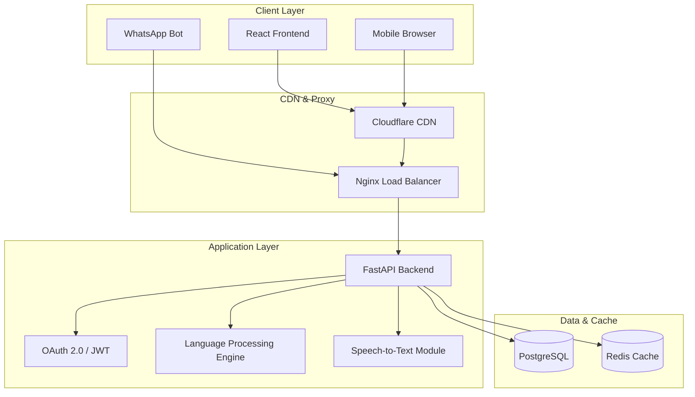

# JanSahay AI
**Voice-First Multilingual AI Assistant for Government Scheme Access in India**
> Helping 1.4 billion citizens discover government schemes, check eligibility, and get application guidance — in their own language.
---
## Executive Summary
JanSahay AI bridges the gap between Indian citizens and government welfare programs. By leveraging generative AI, natural language processing, and advanced voice recognition, the platform provides seamless access to complex scheme information without requiring digital literacy or English proficiency.
### Core Capabilities
- **Voice-First Interaction:** Natively supports voice input in Hindi, Bengali, Tamil, Telugu, and Marathi.
- **Multilingual UI & NLP:** Operates across 6 major Indian languages seamlessly.
- **Intelligent Recommendations:** ML-powered matrix matching user profiles with scheme requirements.
- **Instant Eligibility Verification:** Real-time pass/fail logic with granular, transparent reasoning.
- **Analytics & Impact Tracking:** Comprehensive dashboard for tracking user demographics and scheme popularity.
---
## System Architecture
The application is built on a highly scalable, decoupled architecture designed for low-bandwidth environments.

---
## Project Structure
```text
jansahay-ai/
├── backend/
│   ├── app/
│   │   ├── api/v1/          # Core API route handling
│   │   ├── auth/            # Security & RBAC implementation
│   │   ├── middleware/      # Request limiting and CORS
│   │   ├── models/          # SQLAlchemy Database ORM
│   │   ├── schemas/         # Pydantic validation schemas
│   │   ├── services/        # AI, NLP, and Eligibility logic
│   │   └── main.py          # Application entry point
│   ├── Dockerfile
│   └── requirements.txt
├── frontend/
│   ├── src/
│   │   ├── components/      # Reusable React components
│   │   ├── i18n/            # Translation matrices
│   │   ├── App.jsx          # Application routing
│   │   └── index.css        # Indian Civic Design System
│   ├── Dockerfile
│   └── vite.config.js
└── docker-compose.yml       # Container orchestration
```
---
## Technical Setup & Deployment
### Local Development
**Backend Initialization:**
```bash
cd backend
pip install -r requirements.txt
cp .env.example .env
uvicorn app.main:app --reload --port 8000
```
**Frontend Initialization:**
```bash
cd frontend
npm install
npm run dev
```
### Containerized Deployment
Ensure Docker and Docker Compose are installed on your target machine:
```bash
docker-compose up --build -d
```
- **Backend API:** `http://localhost:8000`
- **Frontend App:** `http://localhost:3000`
- **Swagger Documentation:** `http://localhost:8000/docs`
---
## Technical Documentation
Detailed documentation is available in the `docs/` directory:
1. **[System Architecture](docs/architecture.md):** Deep dive into the component interaction.
2. **[Database Schema](docs/database-schema.md):** Entity-relationship maps and indexing strategies.
3. **[API Reference](docs/api-reference.md):** Complete endpoint specifications.
4. **[ML Model Design](docs/ml-model-design.md):** Translation and intent-matching workflows.
5. **[Production Deployment](docs/deployment.md):** AWS ECS and Vercel infrastructure guides.
---
## Security & Compliance
The platform is designed with enterprise-grade security tailored for government data interaction:
- **Transport:** Strict HTTPS/TLS 1.3 enforcement.
- **Authentication:** OAuth 2.0 flows with short-lived JWTs.
- **Data Protection:** bcrypt hashing (cost factor 12) for credentials.
- **Access Control:** Role-Based Access Control (Citizen, Admin, Official).
- **Protection:** OWASP Top 10 mitigation and strict rate limiting.
---
*Built for Bharat — Serving 29 States & Union Territories*
