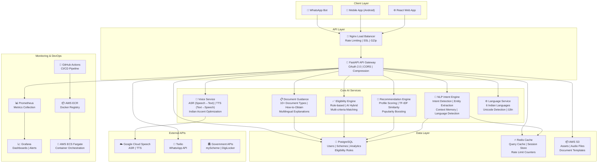
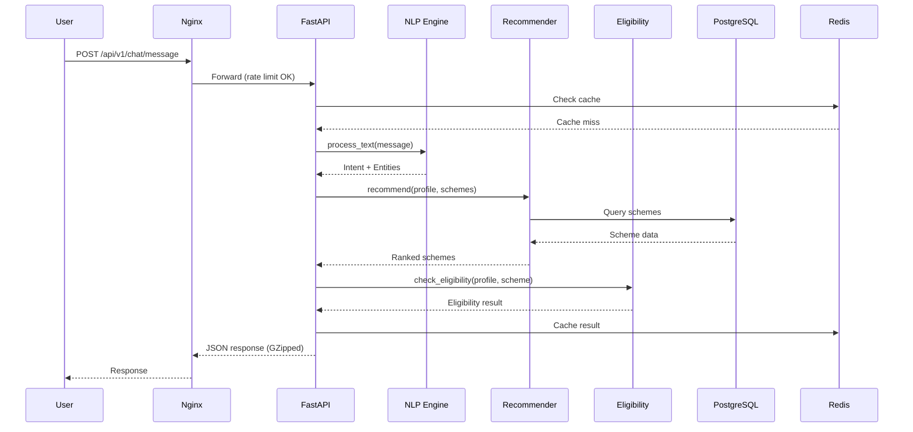

# JanSahay AI - System Architecture

## Overview
JanSahay AI is a voice-first multilingual AI assistant for government scheme access in India, built as a microservices architecture deployed on AWS.

## Architecture Diagram

## Request Flow

## Service Responsibilities

| Service | Technology | Purpose |
|---------|-----------|---------|
| API Gateway | FastAPI + Uvicorn | Routing, auth, middleware |
| NLP Engine | Python (regex + patterns) | Intent detection, entity extraction |
| Voice Service | Google Cloud Speech API | ASR, TTS, Indian accent support |
| Recommender | TF-IDF + weighted scoring | Scheme ranking by profile match |
| Eligibility | Rule engine + fuzzy logic | Multi-criteria eligibility checks |
| Documents | Static + dynamic lookup | Document guidance & how-to-obtain |
| Language Service | Unicode detection + i18n | 6 Indian language support |

## Data Flow
1. **User input** → Voice (ASR) or Text
2. **Language detection** → Unicode script analysis
3. **NLP processing** → Intent + entity extraction
4. **Context merge** → Session memory enrichment
5. **Service routing** → Based on detected intent
6. **Response generation** → Localized text + optional audio (TTS)
7. **Caching** → Redis TTL-based caching for repeat queries
