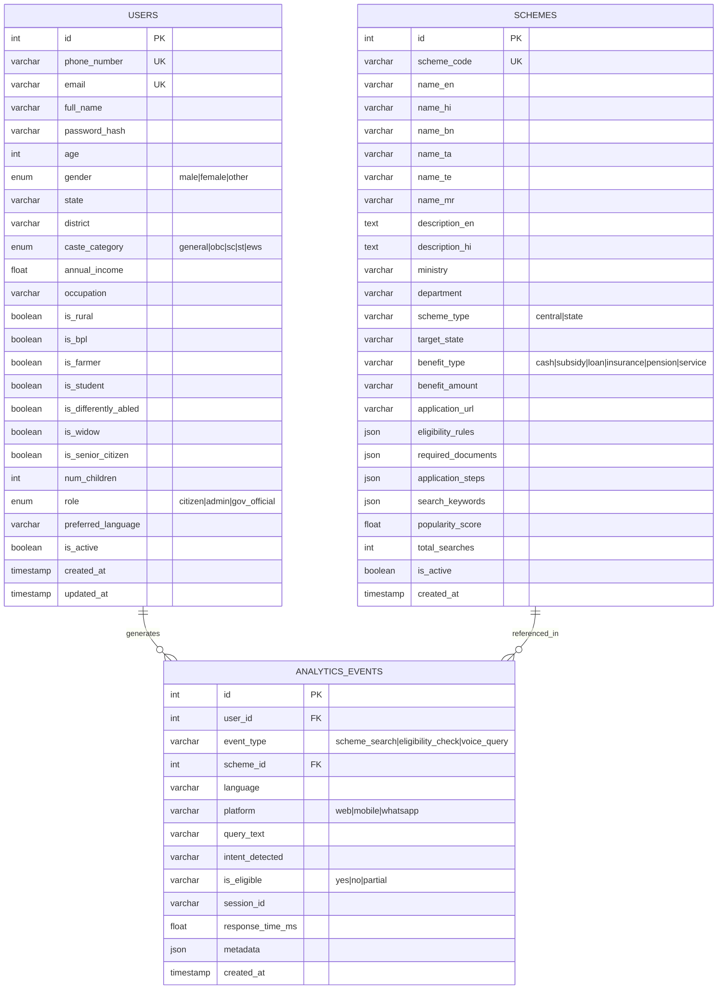

# JanSahay AI - Database Schema Design

## ER Diagram

## Table Details

### `users` — 23 columns
Stores citizen profiles with demographic data crucial for scheme matching.

### `schemes` — 25 columns
Government scheme database with multilingual metadata, JSON eligibility rules, and required documents.

### `analytics_events` — 13 columns
Event tracking for searches, eligibility checks, voice queries, and platform usage.

## Indexes
- `users.phone_number` — Unique, for login
- `users.email` — Unique, for login
- `schemes.scheme_code` — Unique, for lookups
- `analytics_events.event_type` — For dashboard queries
- `analytics_events.created_at` — For time-range queries
