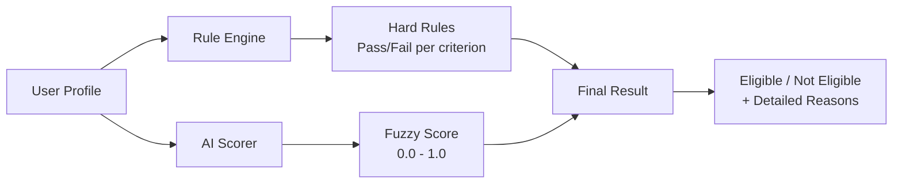
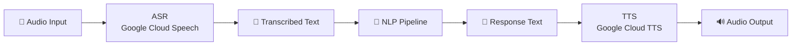

# JanSahay AI - ML Model Design

## 1. NLP Intent Engine

### Architecture
- **Type**: Pattern-based keyword classifier (production-ready without GPU)
- **Upgrade path**: IndicBERT / mBERT fine-tuned model

### Intent Classes
| Intent | Description | Confidence Threshold |
|--------|-------------|---------------------|
| `scheme_discovery` | Find/search schemes | 0.6 |
| `eligibility_check` | Check if eligible | 0.6 |
| `document_requirement` | What documents needed | 0.6 |
| `application_guidance` | How to apply | 0.6 |
| `greeting` | Hello/start | 0.5 |
| `general_query` | Fallback | 0.3 |

### Entity Extraction
| Entity | Method | Examples |
|--------|--------|----------|
| Age | Regex (multilingual) | "age 25", "उम्र 30", "25 years old" |
| Income | Regex + unit detection | "₹1.5 lakh", "income 200000" |
| Gender | Keyword matching | "female", "महिला", "মহিলা" |
| State | Fuzzy string match | "UP", "Uttar Pradesh", "उत्तर प्रदेश" |
| Caste | Keyword matching | "SC", "OBC", "अनुसूचित जाति" |
| Occupation | Keyword matching | "farmer", "किसान", "student" |

### Language Detection
- **Method**: Unicode script range analysis
- **Scripts**: Devanagari (Hindi/Marathi), Bengali, Tamil, Telugu
- **Disambiguation**: Marathi-specific markers differentiate from Hindi

---

## 2. Recommendation Engine

### Algorithm: Weighted Profile Scoring + Content-Based Filtering

```
Final Score = Σ (weight_i × match_score_i) + text_similarity + popularity_boost
```

### Scoring Weights
| Dimension | Weight | Matching Logic |
|-----------|--------|---------------|
| State match | 0.15 | Exact or all-India |
| Income match | 0.15 | Within max_income threshold |
| Age match | 0.12 | Within [min_age, max_age] range |
| Caste match | 0.12 | In allowed categories list |
| Gender match | 0.10 | In allowed genders list |
| Occupation match | 0.10 | In allowed occupations |
| Rural/Urban | 0.08 | Boolean match |
| BPL status | 0.08 | Boolean match |
| Text similarity | 0.05 | TF-IDF cosine similarity |
| Popularity | 0.05 | Normalized search count |

### Text Matching: TF-IDF + Cosine Similarity
1. Tokenize query and scheme description
2. Build TF (term frequency) vectors
3. Apply IDF (inverse document frequency) weighting
4. Compute cosine similarity between vectors

---

## 3. Eligibility Engine

### Architecture: Rule-Based + AI Hybrid



### Rule Operators
| Operator | Description | Example |
|----------|-------------|---------|
| `eq` | Equals | `has_land == true` |
| `neq` | Not equals | `gender != male` |
| `gt` / `gte` | Greater than | `age >= 18` |
| `lt` / `lte` | Less than | `income <= 200000` |

### Eligibility Categories
- **Eligible** (100% criteria met): Full match score
- **Partially Eligible** (50-99% criteria met): Shows what's missing
- **Not Eligible** (<50% criteria met): Shows all failing criteria

---

## 4. Voice Pipeline



### Indian Accent Optimization
- Speech contexts with domain-specific Hindi phrases (योजना, पात्रता, आधार)
- Boost factor of 15.0 for government scheme vocabulary
- Alternative language codes for code-switching detection
- Enhanced model with `use_enhanced=True`

### Fallback Strategy
1. If ASR fails → Prompt text input
2. If TTS fails → Return text-only response
3. If API unavailable → Use mock responses for development
