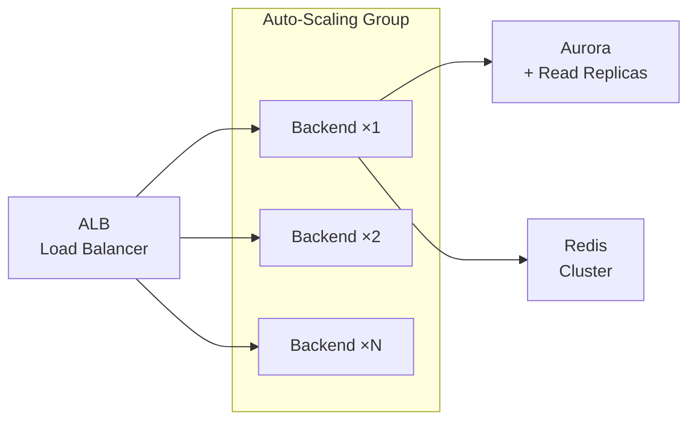

# JanSahay AI - Scalability Plan

## Scaling Strategy for Bharat-Scale Deployment

### Horizontal Scaling

### Scaling Triggers

| Metric | Scale Out | Scale In |
|--------|-----------|----------|
| CPU Utilization | > 70% | < 30% |
| Memory | > 80% | < 40% |
| Request Count | > 1000 req/min | < 200 req/min |
| Response Time (p95) | > 2 seconds | < 500ms |

### Target Capacity

| Users | Backend Tasks | DB Instance | Redis | CDN Bandwidth |
|-------|---------------|-------------|-------|---------------|
| 10K | 2 | db.t3.medium | cache.t3.micro | 50 GB/mo |
| 100K | 4 | db.r6g.large | cache.r6g.large | 500 GB/mo |
| 1M | 10 | db.r6g.xlarge + 2 replicas | 3-node cluster | 2 TB/mo |
| 10M | 20+ | db.r6g.2xlarge + 4 replicas | 6-node cluster | 10 TB/mo |

## Caching Strategy (Low Bandwidth Optimization)

| Cache Layer | TTL | Purpose |
|-------------|-----|---------|
| Redis (scheme list) | 30 min | Avoid repeated DB queries |
| Redis (scheme detail) | 1 hour | Individual scheme pages |
| Redis (recommendations) | 15 min | AI recommendations per profile |
| Client-side (Service Worker) | 24 hours | Offline scheme data |
| CDN (static assets) | 30 days | CSS, JS, images |
| CDN (API responses) | 5 min | Frequently accessed endpoints |

## Database Scaling
1. **Aurora Auto Scaling**: Read replicas auto-scale 1-15
2. **Connection Pooling**: PgBouncer for efficient connections
3. **Partitioning**: Analytics table partitioned by month
4. **Indexing**: Composite indexes on (scheme_type, target_state, is_active)

## Regional Deployment
- **Primary Region**: ap-south-1 (Mumbai)
- **DR Region**: ap-south-2 (Hyderabad) — Aurora Global Database
- **CDN PoPs**: 13 CloudFront edge locations in India

## Performance Targets
| Metric | Target |
|--------|--------|
| API Response Time (p50) | < 200ms |
| API Response Time (p95) | < 1 second |
| Voice Processing (ASR+TTS) | < 3 seconds |
| Uptime SLA | 99.9% |
| Recovery Time Objective | < 15 minutes |
