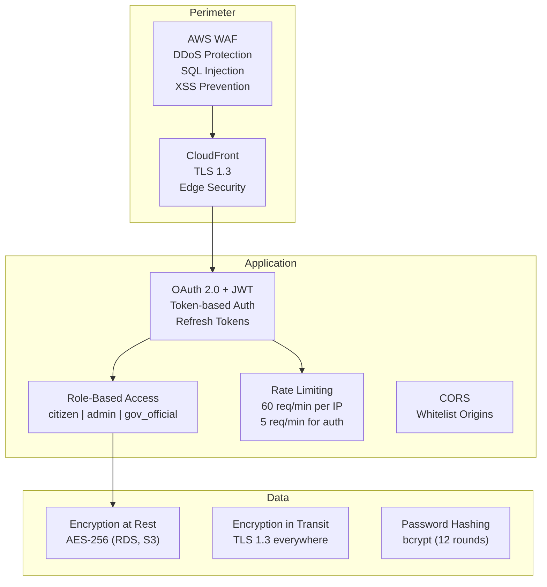

# JanSahay AI - Security Implementation

## Security Architecture



## 1. HTTPS/TLS
- **TLS 1.3** enforced via CloudFront + ALB
- **HSTS** headers with 1-year max-age
- **ACM** managed SSL certificates (auto-renewed)
- All internal service communication over TLS

## 2. Authentication (OAuth 2.0)
- **JWT Access Tokens**: 60-minute expiry, signed with HS256
- **Refresh Tokens**: 30-day expiry, stored securely
- **Password Hashing**: bcrypt with 12 rounds
- Token payload: `{ sub: user_id, role: "citizen", exp: timestamp }`

## 3. Role-Based Access Control (RBAC)
| Role | Permissions |
|------|------------|
| `citizen` | Search schemes, check eligibility, chat, voice |
| `admin` | All citizen + analytics dashboard + user management |
| `gov_official` | All citizen + analytics read-only |

## 4. Data Encryption
- **At Rest**: AWS RDS encryption (AES-256), S3 SSE-S3
- **In Transit**: TLS 1.3 for all connections
- **Secrets**: AWS Systems Manager Parameter Store (encrypted)
- **PII**: Minimal collection, opt-in only

## 5. Rate Limiting
| Endpoint | Limit | Burst |
|----------|-------|-------|
| API (general) | 60/min | 20 |
| Auth (login/register) | 5/min | 3 |
| Voice processing | 20/min | 5 |
| Health check | Unlimited | — |

## 6. Session-Level Privacy
- Each conversation session has a unique `session_id`
- Session data cleared after 24 hours
- No cross-session data sharing
- Anonymous usage allowed (no mandatory registration)

## 7. Input Validation
- All inputs validated via **Pydantic** schemas
- SQL injection prevented by **SQLAlchemy ORM** (parameterized queries)
- XSS prevention via **React DOM escaping** + **CSP headers**
- File upload restrictions (audio files only, max 10MB)

## 8. Security Headers
```
X-Frame-Options: SAMEORIGIN
X-Content-Type-Options: nosniff
X-XSS-Protection: 1; mode=block
Referrer-Policy: strict-origin-when-cross-origin
Content-Security-Policy: default-src 'self'; script-src 'self'
```

## 9. OWASP Top 10 Compliance
| Risk | Mitigation |
|------|-----------|
| Injection | Parameterized queries (SQLAlchemy) |
| Broken Auth | JWT + bcrypt + rate limiting |
| Sensitive Data | Encryption at rest + transit |
| XML External Entities | No XML processing |
| Broken Access Control | RBAC middleware |
| Security Misconfiguration | Environment-based config |
| XSS | React DOM + CSP |
| Insecure Deserialization | Pydantic validation |
| Known Vulnerabilities | Dependabot alerts |
| Insufficient Logging | Prometheus + CloudWatch |

## 10. Compliance
- **DPDPA (India)**: Minimal data collection, user consent for PII
- **IT Act 2000**: Data stored in India (ap-south-1)
- **Aadhaar data**: Never stored server-side, used only for verification
